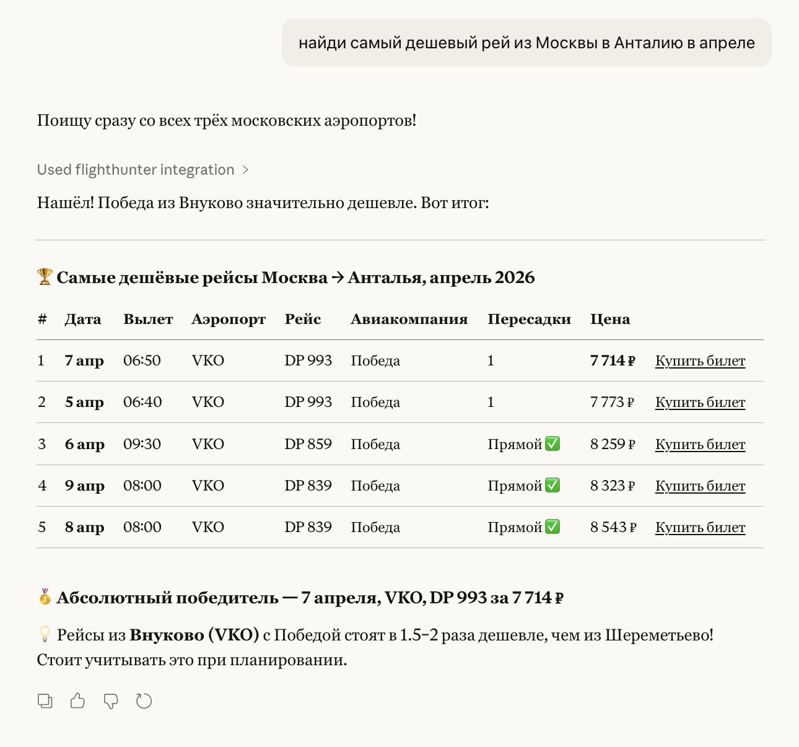

# ✈️ FlightHunter MCP

A Model Context Protocol (MCP) server that gives Claude the ability to search for cheap flights — including Russian airlines — and present direct booking links.

---

## Preview




---

## Features

- 🔍 Search flights by specific date
- 📅 Find cheapest dates across a date range
- 🇷🇺 Russian airlines included (Aeroflot, Pobeda, S7, NordStar, and more)
- 🌍 Global routes via Google Flights
- 💸 Direct booking links in results
- ⚡ Works inside Claude Desktop — just ask naturally

---
## Preview


## Requirements

- macOS or Linux
- [Claude Desktop](https://claude.ai/download)
- [uv](https://docs.astral.sh/uv/getting-started/installation/) package manager

---

## Installation

### 1. Install the base package via uv

```bash
uv tool install flights
```

### 2. Find your install path

```bash
SITE=$(find ~/.local -path "*/site-packages/fli" -type d | head -1)
echo $SITE
```

### 3. Install FlightHunter files

Download `fare_search.py` and `server.py` from this repo, then:

```bash
cp fare_search.py "$SITE/search/fare_search.py"
cp server.py "$SITE/mcp/server.py"
```

### 4. Install the FlightHunter launcher

```bash
cp flighthunter-mcp /Users/YOUR_USERNAME/.local/bin/flighthunter-mcp
chmod +x /Users/YOUR_USERNAME/.local/bin/flighthunter-mcp
```

### 5. Configure Claude Desktop

Open your Claude Desktop config:

```bash
# macOS
nano ~/Library/Application\ Support/Claude/claude_desktop_config.json

# Linux
nano ~/.config/Claude/claude_desktop_config.json
```

Add the following (replace `YOUR_USERNAME` with your macOS username):

```json
{
  "mcpServers": {
    "FlightHunter": {
      "command": "/Users/YOUR_USERNAME/.local/bin/flighthunter-mcp",
      "args": []
    }
  }
}
```

### 6. Restart Claude Desktop

Quit and reopen Claude Desktop. The FlightHunter tools will appear automatically.

---

## Usage

Once installed, just ask Claude naturally:

```
Find me the cheapest flights from Moscow to Antalya in April
```

```
Search for flights SVO → AYT on April 7
```

```
What are the cheapest travel dates from LED to BCN in May?
```

```
Find round-trip flights from JFK to LHR next month
```

Claude will return results sorted by price with direct booking links.

---

## How It Works

```
Claude
  ↓
FlightHunter MCP Server
  ↓                ↓
Google Flights    Fare Search Engine
(global routes)   (domestic + CIS routes)
  ↓                ↓
  └──── merged, sorted by price ────┘
              ↓
    Results with booking links
```

---

## Optional Configuration

| Variable | Description | Default |
|----------|-------------|---------|
| `FLIGHTHUNTER_CURRENCY` | Currency code for results | `USD` |
| `FLIGHTHUNTER_PASSENGERS` | Default passenger count | `1` |
| `FLIGHTHUNTER_MAX_RESULTS` | Max results returned | unlimited |
| `FLIGHTHUNTER_CABIN_CLASS` | Default cabin class | `ECONOMY` |

Example:

```json
{
  "mcpServers": {
    "FlightHunter": {
      "command": "/Users/YOUR_USERNAME/.local/bin/flighthunter-mcp",
      "args": [],
      "env": {
        "FLIGHTHUNTER_CURRENCY": "RUB",
        "FLIGHTHUNTER_MAX_RESULTS": "20"
      }
    }
  }
}
```

---

## License

MIT
